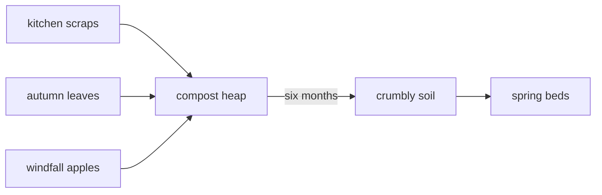

# compost

the heap is behind the shed. i turn it once a month, more often in summer.

```mermaid
flowchart LR
  scraps[kitchen scraps] --> heap[compost heap]
  leaves[autumn leaves] --> heap
  apples[windfall apples] --> heap
  heap -->|six months| soil[crumbly soil]
  soil --> beds[spring beds]
```

last turned on the date in the [[garden journal]].
