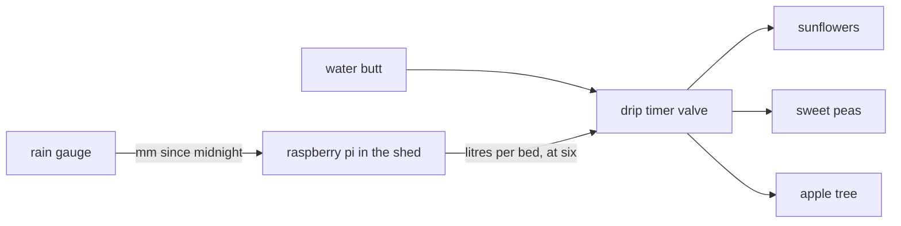

# drip setup

how the water gets from the butt to the beds. [[watering]] runs on the raspberry pi.

```mermaid
flowchart LR
  gauge[rain gauge] -->|mm since midnight| pi[raspberry pi in the shed]
  butt[water butt] --> valve[drip timer valve]
  pi -->|litres per bed, at six| valve
  valve --> sunflowers[sunflowers]
  valve --> peas[sweet peas]
  valve --> apple[apple tree]
```

the lavender bed by the gate has no drip line at all.
